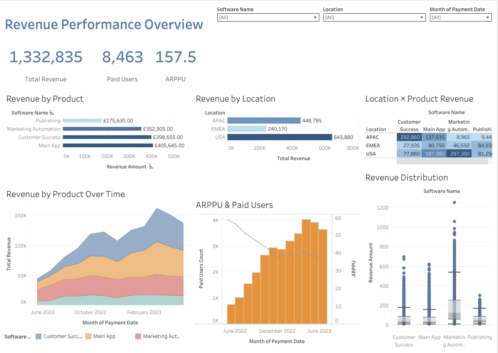

# SaaS Revenue Dashboard (Tableau)

Interactive Tableau dashboard for SaaS revenue analysis and business performance tracking.

## Project Overview

This dashboard analyzes:
- Total Revenue
- Paid Users
- ARPPU (Average Revenue Per Paid User)
- Revenue trends over time
- Revenue by product
- Revenue by location

The project also includes bonus visualizations such as:
- Revenue distribution box plot
- Revenue share by location over time

## Dashboard Features

- Interactive filters
- Dashboard actions
- KPI cards
- Dual-axis charts
- Heatmaps
- Time-series analysis

## Tools Used

- Tableau Public
- Data Visualization
- Dashboard Design
- Calculated Fields
- Table Calculations

## Dashboard Preview

## Tableau Public

[Open Interactive Dashboard] (https://public.tableau.com/views/Anzhelika_Ivanova_Revenue_dashboard/Dashboard1?:language=en-GB&:sid=&:redirect=auth&:display_count=n&:origin=viz_share_link)

## Tech Stack

- Tableau Public
- Data Visualization
- Dashboard Design
- Business Analytics

## Key Insights

- Main App generated the highest revenue
- USA region contributed the largest revenue share
- Paid Users increased over time
- ARPPU showed a gradual decline as user base expanded

## Author

Anzhelika Ivanova
